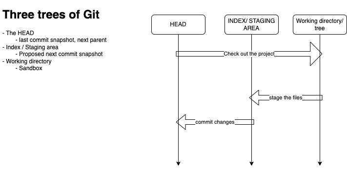
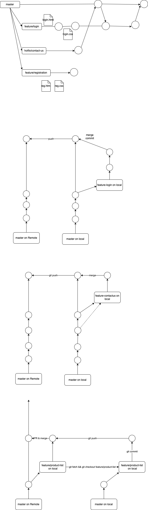

# Git using VS Code

-   Created by Linus Trovalds
-   Was using BitKeeper to manage lunix code
-   Ran into some kind of licensing issues
-   April 5, 2005 (first version)
-   Distributed Version Control

### Centralized Version Control

-   Server with some kind of database
-   Clinets checkout a working copy of the code

Examples:

-   Subversion (SVN), Tortoise
-   Visual SourceSafe
-   Mercurial

Challenges:

-   Multi-developer conflicts
-   Client/server communication

### Distributed Version Control

-   Concept of repositories on Server and Client machines
-   Every working checkout is a repository
-   Once you have checkout the code from the remote, you can independently work on your local repository
-   In fact, you don't even need a remote repository

Examples:

-   BitKeeper
-   Darcs
-   Bazaar

### Advantages of Git

-   Resilience
-   Speed (relative to other/old SCM tools)
-   Space
    -   Compression is done acorss repository, not just per file
    -   Minimizes the local size as well as push/pull data transfers
-   Simple
-   A very large user base (with lots of robust tools)

### A very basic workflow

-   Create a repository (either initialize a new one or clone an existing one)
-   Code or edit files
-   Stage the changes
-   Review your changes
-   Commit your changes
-   Optionally sync with the remote repository (push/pull)

### Getting started with commands:

-   `git --version`
-   `git config --list`
-   `git conifg --global user.name "Vinod"`
-   `git conifg --global user.email "vinod@vinod.co"`
-   `git init`
-   `git status`
-   `git add hello.py`
-   `git commit -m "this is my first commit"`
-   `git log`

### Git branches

-   By default git creates a branch called `master`
-   This is our **base branch**
-   This is the one running in production server
-   NEVER WORK ON YOUR BASE BRANCH!!!
-   We want a copy of all the files in our base branch, that we can modify (or add to) independently, with out affecting our base branch
-   Solution: `git branch`

Typical workflow is:

-   Create a new branch for the specific work
    -   `git branch NEW_BRANCH_NAME`
-   Switch to the newly created branch
    -   `git checkout NEW_BRANCH_NAME`
-   Stage/commit your work in the new branch
    -   `git add .`
    -   `git commit`
-   Review the changes and merge to the base branch
    -   create a pull request (for review by others)
    -   `git merge`
-   Delete the branch (if not needed any more)
    -   `git branch -D NEW_BRANCH_NAME`

Some related commands:

-   `git branch`
-   `git branch feature/login`
-   `git checkout feature/login`
-   `git checkout -b feature/registration`

While you are in the `master` branch:

-   `git merge feature/login`
-   `git branch -D feature/login`

### Git stash

Allows you to save your uncommited work without having to create a new commit.

- `git stash` to push the current state to the stash and rollback to the previous commit
- `git stash list`
- `git stash pop` to apply the latest stashed changes and remove the content from the stash
- `git stash apply stash@{0}` - applys the latest (or specified index) stashed changes, without removing the content the stash
- `git stash push -m "just started working on the login form"` - stash the changes with a message
- `git stash drop stash@{2}`
- `git stash clear`

